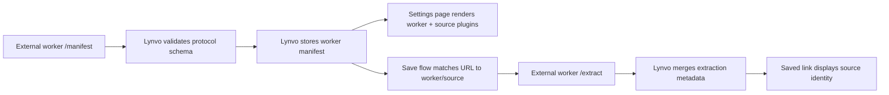

# How Lynvo Consumes External Extractor Metadata

Lynvo treats every out-of-process extractor as a worker that publishes metadata
through the protocol. An extractor may be the first-party managed official
Worker reached through a private Service Binding or a user-provided Worker
reached through HTTPS.

## Manifest Metadata

The validated manifest is Lynvo's source of extractor identity. User Worker
manifests are stored at registration; the managed official manifest is resolved
through the binding and reused within the request.

Lynvo reads:

- worker `extractorId`, `displayName`, and `iconUrl`
- source/plugin `id`, `displayName`, `iconUrl`, `status`, `version`
- source/plugin `hosts` and `matchers`

This powers:

- the external extractor settings table
- source-aware URL preview
- saved-link source labels and icons

## Extraction Metadata

`POST /extract` may return source metadata too, but it is enrichment data. It
should not be required to repeat everything from the manifest.

Lynvo merges metadata defensively:

- manifest metadata is kept when extraction omits a field
- extraction metadata can add page-level details like `pageTitle` or `audio`
- undefined extraction fields do not erase known manifest fields

## Boundary Rule

If a new external extractor supports a new source, Lynvo should not add a
source-specific branch for it. The extractor should publish that source under
`extensions.lynvo.sources`, and Lynvo should continue rendering the generic
metadata contract.
