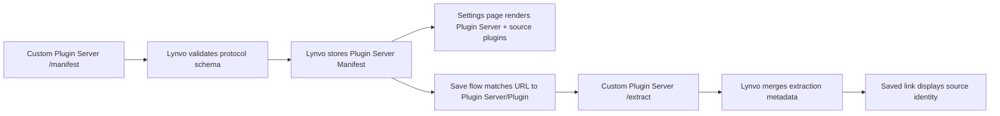

# How Lynvo Consumes Plugin Server Metadata

Lynvo treats every out-of-process integration as a Plugin Server that publishes metadata
through the protocol. It may be the Lynvo Plugin Server reached through a private Service Binding or a
Custom Plugin Server reached through HTTPS.

## Manifest Metadata

The validated manifest is Lynvo's source of Plugin Server identity. Custom Plugin Server
manifests are stored at registration; the managed official manifest is resolved
through the binding and reused within the request.

Lynvo reads:

- Plugin Server `pluginServerId`, `displayName`, and `iconUrl`
- Plugin `id`, `displayName`, `iconUrl`, `status`, `version`
- Plugin `hosts` and `matchers`

This powers:

- the Custom Plugin Server settings table
- source-aware URL preview
- saved-link source labels and icons

## Extraction Metadata

`POST /extract` may return source metadata too, but it is enrichment data. It
should not be required to repeat everything from the manifest.

Lynvo merges metadata defensively:

- manifest metadata is kept when extraction omits a field
- extraction metadata can add page-level details like `pageTitle` or `audio`
- undefined extraction fields do not erase known manifest fields

## Boundary Rule

If a new Custom Plugin Server supports a new Source, Lynvo should not add a
Source-specific branch for it. The Plugin Server should publish its Plugin under
`extensions.lynvo.plugins`, and Lynvo should continue rendering the generic
metadata contract.
