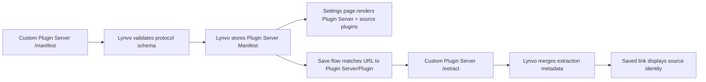

# How Lynvo consumes Plugin Server metadata

Lynvo treats every out-of-process integration as a Plugin Server that publishes
metadata through the protocol. The integration may be the Lynvo Plugin Server
reached through a private Service Binding or a Custom Plugin Server reached
through HTTPS.

## Manifest metadata

Lynvo uses the validated manifest to identify a Plugin Server. Lynvo stores
Custom Plugin Server manifests at registration. It resolves the managed Lynvo
Plugin Server manifest through the binding and reuses it for the request.

Lynvo reads:

- Plugin Server `pluginServerId`, `displayName`, and `iconUrl`
- Plugin `id`, `displayName`, `iconUrl`, `status`, `version`
- Plugin `hosts` and `matchers`

Lynvo uses this data for:

- the Custom Plugin Server settings table
- source-aware URL preview
- saved-link source labels and icons

## Extraction metadata

`POST /extract` may return source metadata too, but that data supplements the
manifest. The response does not need to repeat every manifest field.

Lynvo merges metadata defensively:

- manifest metadata is kept when extraction omits a field
- extraction metadata can add page-level details like `pageTitle` or `audio`
- undefined extraction fields do not erase known manifest fields

## Boundary rule

When a Custom Plugin Server adds a Source, Lynvo does not add a Source-specific
branch. The Plugin Server publishes its Plugin under
`extensions.lynvo.plugins`, and Lynvo renders the same metadata contract.
